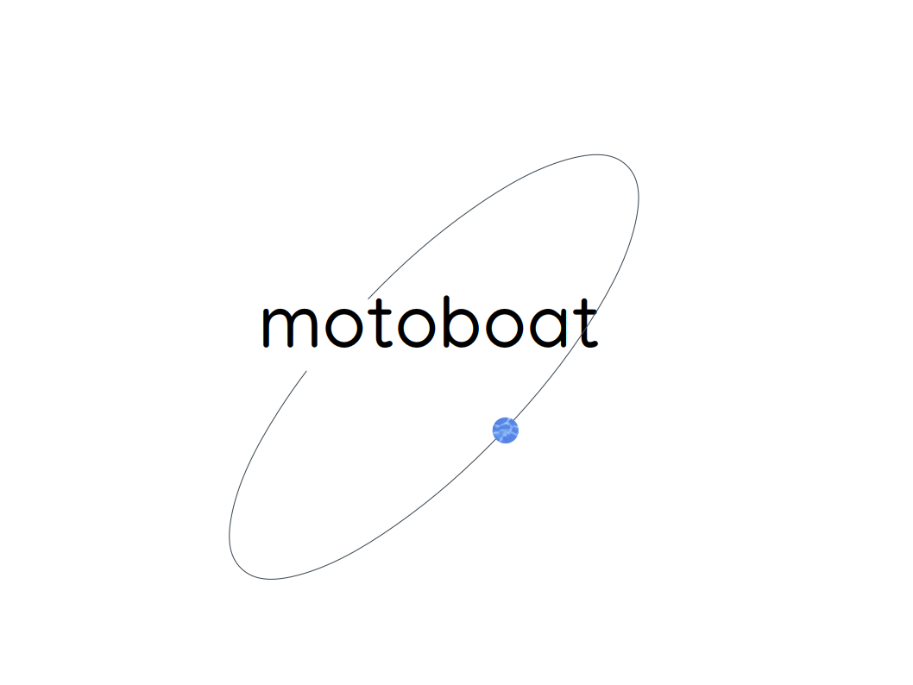
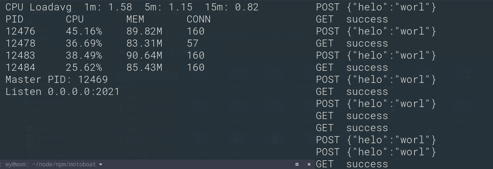

# motoboat



基于Node.js的Web框架，使用async/await关键字解决回调过度嵌套。

支持HTTP/HTTPS。若要使用HTTP/2，请使用框架[titbit](https://github.com/master-genius/titbit)。

**查看更详细的内容，请点击[Wiki](https://github.com/master-genius/motoboat/wiki)**

motoboat通过一个被称为请求上下文的对象打包了需要的数据以及原始的请求对象（request和response）。通过请求上下文对象可以获取本次请求所有的信息。

支持主要功能：

* 中间件
* 路由
* 路由分组/中间件分组
* 限制请求数量
* 守护进程
* cluster集群
* 全局日志
* 显示负载情况

## 安装

`npm install motoboat`

或者git clone此仓库，然后引入motoboat.js文件。


## 示例

``` JavaScript
const mot = require('motoboat');

var app = new mot();

var {router} = app;

router.get('/', async c => {
    /*
        只需要设置c.res.body的值，就会自动返回数据，
        可以是数组，JSON，字符串，数字类型。
    */
    c.res.body = 'success';
});

app.run(8192);

```

## 请求类型

支持GET、POST、PUT、DELETE、OPTIONS请求，分别有对应的小写的方法用于添加路由。

## 处理多个路径

``` JavaScript
const mot = require('motoboat');

var app = new mot();

var {router} = app;

router.get('/', async c => {
    c.res.body = 'success';
});

router.get('/t', async c => {
    c.res.body = 'great';
});

router.post('/pt', async c => {
    c.res.body = 'This is post page';
});

app.run(8192);

```

## 获取URL参数

``` JavaScript
const mot = require('motoboat');

var app = new mot();

var {router} = app;

router.get('/', async c => {
    //URL的查询字符串（?a=1&b=2...），被解析到c.query，以JSON形式存储。
    c.res.body = c.query;
});

app.run(8192);

```

## 获取表单数据

POST或PUT请求会携带请求体数据，常见的是表单提交，也可以是上传文件，或者提交其它格式的文本。

``` JavaScript
const mot = require('motoboat');

var app = new mot();

var {router} = app;

router.get('/', async c => {
    c.res.body = 'success';
});

router.post('/pt', async c => {
    c.res.body = c.body;
});

router.put('/pu', async c => {
    c.res.body = c.body;
});

app.run(8192);

```

## 路由更多内容

路由就是根据域名后的路径去查找并执行对应的函数。框架本身路由的添加方式很简单，支持使用:表示变量，使用*匹配任意路径。并且路由参数只是以字符串形式解析，并不做各种类型转换的处理。解析后的参数保存在param字段。框架支持的请求方法是：GET、POST、PUT、DELETE、OPTIONS。分别有对应小写的方法。

``` JavaScript

/*
  name可以是任意字符串，访问形式:
    /page/index.html
    /page/a.html
*/
serv.get('/page/:name', async c => {
  //解析后的参数保存在c.param
  c.res.body = c.param['name'];
});

serv.get('/login/:username/:passwd', async c => {
  var {username, passwd} = c.param;
  //....
});

serv.options('/*', async c => {
  //接管所有的OPTIONS请求
  //...
});

/**
 * 路由分组，所有的路径都会带上/api
 */
var api = router.group('/api');
//实际请求路径/api/a
api.get('/a', async c => {
    //...
});

api.post('/a', async c => {
    //...
});

//同时处理多个方法
api.map(['GET','POST','PUT'], '/x', async c => {
    //...
});

//请求命名
router.put('/who', async c => {
    //通过c.name获取名称
    c.res.body = c.name;
}, 'Albert·Einstein');

```

## 中间件

这个是框架设计的核心，实际上，请求处理过程都是中间件模式层层调用。通过中间件模式，可以把复杂的业务逻辑更好地进行分离，并进行灵活的拼接调用。中间件的工作方式可以用下图描述。


按照这样的模型设计，后添加的中间件先执行，而在返回时，则是从核心逐层向外返回。其实就是栈结构调用方式。

**但是，按照代码编写的前后逻辑运行更符合多数人的方式，这种正序执行的方式也是可以的。Node.js中一些框架就是这样的。**

**我曾经接触过的多数场景，PHP中的slim框架4.0以前的版本，Python装饰器等都是逆序的，后添加先执行。可是为了照顾开发者，并且也可以提供多一种模式，中间件提供了use方法按照顺序添加中间件，同时有add方法是按照后添加先执行的原则，甚至你可以同时使用这两个方法。use方法的执行方式和koa一致。**

## 中间件示例场景

比如，需要用户登录才可以操作的接口，而在登录后，还需要验证用户权限，最后是核心业务逻辑。这样的方式可以通过两个中间件来解决，在任一层中间件检测非法则直接返回，不会穿透到核心业务。并且修改和扩展都比较方便，编写中间件和核心业务处理可以独立进行。

## 编写中间件

中间件编写的参数有固定格式，执行下一层中间件也有固定写法。

``` JavaScript

var {router} = serv;

/**
 * 使用add添加中间件，中间件一定是async声明的函数，
 * 接受两个参数，c是请求上下文，next表示下一层中间件。
 * 要执行则只需要await next(c)。
 * 如果检测发现不合法需要停止向内执行，则只需要不写await next(c)
 * 
 * add同时接受第二个参数，如果不填写则表示全局执行。
 * 
 * */
serv.add(async (c, next) => {
  c.res.body += 'I am middleware';
  await next(c);
  c.res.body += 'middleware end';
}, {preg: '/mid-test'});

router.get('/mid-test', async c => {
  c.res.body += 'This test page for middleware';
});

```

访问/mid-test返回结果：

```

I am middleware
This test page for middleware
middleware end

```

使用add接口添加中间件，接受两个参数，第一个是请求上下文，第二个next表示下一层中间件。要执行则只需要

`await next(c)`

如果检测发现不合法需要停止向内执行，则只需要不写 await next(c)。

add支持第二个参数，如果没有表示全局执行，所有的请求都会先执行此中间件，否则可以填写值如下：

* 字符串/字符串数组：表示针对哪个路由或哪些使用中间件。

* JSON对象：{preg: PREG, group: GROUP, method: METHOD}，preg表示匹配规则，group表示组名称，method是请求类型，比如GET/POST，3个都是可选项，参考值如下：
     * preg：字符串/字符串数组
     * group：字符串
     * method：字符串/字符串数组

提供这些复杂的功能是为了方便的处理实际需要，比如针对上传文件检测等一系列操作的中间件则不需要在其他请求类型以及路径下执行。那么，如果什么选项也不使用，则就好比使用了一个最简模式全局的中间件机制。

以下是一个更加复杂的示例：

``` JavaScript
//分组名称如果没有最开始的/则会自动加上，并且会去掉末尾的/
var api = router.group('/api');

//只对api分组添加中间件
serv.add(async (c, next) => {
    //...
}, api.groupName);

//只在api分组添加中间件，并且只有路由是/api/what时才会执行此中间件。
serv.add(async (c, next) => {
    //...
}, {group: api.groupName, preg: `${api.groupName}/what`});

router.get('/great', async c => {
  c.res.body += 'This test page for middleware';
});

api.get('/nice', async c => {
  c.res.body += 'This test page for middleware, group: '+c.group;
});

api.get('/what', async c => {
  c.res.body += 'what?';
});

```
>
> * 中间件使用方式太灵活也容易导致错误，并且添加的顺序很重要。如果你想要按照你添加的顺序执行，而不是按照洋葱模型的逆序执行，可以使用辅助函数，传递一个中间件数组，逆序添加即可。
> * 框架本身不是重量级的，所以对于复杂点的应用，往往需要自己建立目录结构。
> * 依靠中间件的分组和匹配功能可以抽象出一个个组件化独立的应用，在example目录中给出了代码示例。
> * 很多框架（不仅仅是Node.js范围内）提供的中间件机制就是全局的，不会涉及任何和分组以及匹配相关的功能，这样的话，无论是哪个路由，都要执行全部的中间件，而依靠分组和匹配可以只执行需要的，速度就会非常快，比如你添加了20个中间件，但是其中某个路由分组下只有2个，并且还有1个全局的，则只会执行这3个，其他的都不会涉及到。
> * 如果你就想要简单的全局的，则只需要开启选项useMinMiddleware为true，在new motoboat的时候传递选项值。这会对接到最小中间件模式。这个时候会使用middleware-min.js模块，而不是middleware.js模块。
>  


## 请求上下文

``` JavaScript
var ctx = {
    app: null,  //在运行时指向当前app环境，包括路由对象，config等。
    method      : '',       //请求方法类型
    url         : {
        host        : '',   //示例，w3xm.top或a.com:8119
        protocol    : '',   //协议，http:或https:
        href        : '',   // /a?name=q
        port        : '',   // 端口
    },
    ip          : '',   //远程客户端IP
    path        : '',   //用户请求的路径，是域名后的部分，不包括查询字符串
    name        : '',   //请求命名，默认为空
    headers     : {},   //请求头信息

    /** 
     * 实际执行请求的路径，如果路径是带参数的，则会与path不同，
     * 如果带参数路由是/page/:name，当请求 /page/home时，
     * path属性的值是/page/home，routepath的值是/page/:name。
     * */
    routepath   : '/',  

    /** 
     * 路由参数，比如/login/:user/:pass，实际请求/login/hello/world。
     * 则路由参数被解析到param：
     *  {
     *     "user" : "hello",
     *     "pass" : "world"
     *  }
    */
    param       : {},

    query       : {}, //查询字符串参数，就是URL中?后面的部分
    body        : {}, //POST或PUT请求提交的表单，也可能是其它格式的文本而不是JSON对象。
    isUpload    : false, //是不是上传文件。
    group       : '', //所属路由分组。
    /** 
     * 原始的Body数据，是没有解析的格式，上传文件自动解析后会清空，
     * 如果不是上传文件则会保留，选项设置不自动解析上传文件数据可以保存此数据。
    */
    rawBody     : '', 
    /** 
     * 解析后的文件存储在此，格式如下：
     *  {
     *    'image' : [
     *      {filename:FILENAME, 'content-type': CONTENT_TYPE, data:'BINARY DATA'},
     *         ...
     *    ],
     *    'audio' : [
     *      {filename:FILENAME, 'content-type': CONTENT_TYPE, data:'BINARY DATA'},
     *      ...
     *    ]
     *  }
     * 
    */
    files       : {}, 
    requestCall : null, //指向要执行请求的函数。
    extName     : helper.extName, //获取文件扩展名
    genFileName : helper.genFileName, //生成唯一文件名

    /**
     * http.Server的request事件传递的参数：
     *   request <http.IncomingMessage>
     *   response <http.ServerResponse>
     * 多数情况不需要直接调用response的end方法，可以调用write，最后框架会自动end。
     * 不过这不是严格限制的，也不涉及所谓的优雅与粗暴，既然信息提供了，怎么用是开发者的事。
     */
    request     : null, 
    response    : null, //很多时候还要使用response提供的其他方法的。

    /**
     * 简单的响应对象，仅仅是为了返回数据。
     */
    res         : {
        data : '',
        encoding : 'utf8' //返回数据的编码类型，如果是图片可以设置为binary。
    },

    //中间件如果需要注入一些对象或值，可以放在box中。
    box : {},
};

//如果是上传文件会用到，用于获取文件。
ctx.getFile = function(name, ind = 0) {
    if (ind < 0) {return ctx.files[name] || [];}

    if (ctx.files[name] === undefined) {return null;}
    
    if (ind >= ctx.files[name].length) {return null;}

    return ctx.files[name][ind];
};
//对response的封装，可以直接使用response。
ctx.res.setHeader = function (name, val) {
    ctx.response.setHeader(name, val);
};

//设置状态码
ctx.res.status = function(stcode = null) {
    if (stcode === null) { return ctx.response.statusCode; }
    if(ctx.response) { ctx.response.statusCode = stcode; }
};
//移动文件到指定位置。
ctx.moveFile = helper.moveFile;

```

## RESTFul

这个无需多说了，按照RESTFul规则设计的接口会比较简单，并且充分能够利用HTTP的语义。

如果不按照这种方式设计，仅仅使用GET和POST，甚至仅仅使用POST请求都可以，已有的项目不少也是这样的。只是这样的话，接口路径设计会很麻烦。

``` JavaScript

var {router} = serv;

//获取具体内容
router.get('/content/:id', async c => {
    //...
});

//获取内容列表
router.get('/content', async c => {
    //...
});

//创建
router.post('/content', async c => {
    //...
});

//根据ID更新指定资源
router.put('/content/:id', async c => {
    //...
});

//删除指定资源
router.delete('/content/:id', async c => {
    //...
});

```
