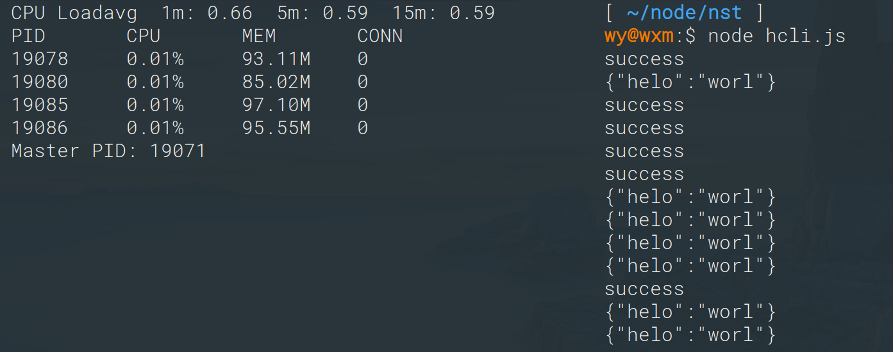
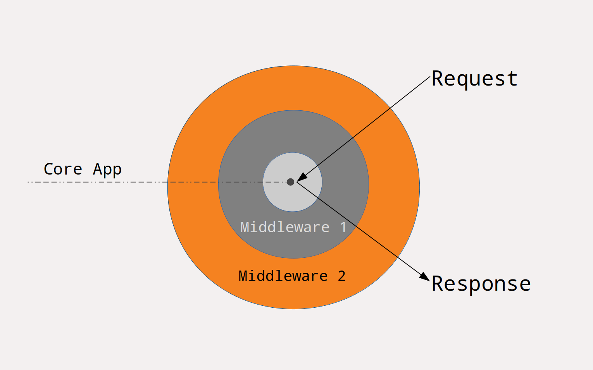

# motoboat

基于Node.js的Web框架，使用async/await关键字解决回调地狱。

支持HTTPS，支持HTTP/1.1协议，不支持HTTP/2。若要使用HTTP/2，请使用框架awix。

motoboat通过一个被称为请求上下文的对象打包了需要的数据以及原始的请求对象（request和response）。通过请求上下文对象可以获取本次请求所有的信息。

支持功能：

* 中间件
* 路由
* 路由分组/中间件分组
* 限制请求数量
* 守护进程
* cluster集群
* 全局日志
* 显示负载情况

## 安装

`npm install motoboat`

或者git clone此仓库，然后引入motoboat.js文件。


## 示例

``` JavaScript
const mot = require('motoboat');

var app = new mot();

var {router} = app;

router.get('/', async c => {
    /*
        只需要设置c.res.data的值，就会自动返回数据，
        可以是数组，JSON，字符串，数字类型。
    */
    c.res.data = 'success';
});

app.run(8192);

```

## 请求类型

支持GET、POST、PUT、DELETE、OPTIONS请求，分别有对应的小写的方法用于添加路由。

## 处理多个路由

``` JavaScript
const mot = require('motoboat');

var app = new mot();

var {router} = app;

router.get('/', async c => {
    c.res.data = 'success';
});

router.get('/t', async c => {
    c.res.data = 'great';
});

router.post('/pt', async c => {
    c.res.data = 'This is post page';
});

app.run(8192);

```

## 获取URL参数

``` JavaScript
const mot = require('motoboat');

var app = new mot();

var {router} = app;

router.get('/', async c => {
    //URL的查询字符串（?a=1&b=2...），被解析到c.param，以JSON形式存储。
    c.res.data = c.param;
});

app.run(8192);

```

## 获取表单数据

POST或PUT请求会携带请求体数据，常见的是表单提交，也可以是上传文件，或者提交其它格式的文本。

``` JavaScript
const mot = require('motoboat');

var app = new mot();

var {router} = app;

router.get('/', async c => {
    c.res.data = 'success';
});

router.post('/pt', async c => {
    c.res.data = c.bodyparam;
});

router.put('/pu', async c => {
    c.res.data = c.bodyparam;
});

app.run(8192);

```

## 中间件

这个是框架设计的核心，实际上，请求处理过程都是中间件模式层层调用。通过中间件模式，可以把复杂的业务逻辑更好地进行分离，并进行灵活的拼接调用。中间件的工作方式可以用下图描述。



按照这样的模型设计，后添加的中间件先执行，而在返回时，则是从核心逐层向外返回。其实就是栈结构调用方式。

## 中间件示例场景

比如，需要用户登录才可以操作的接口，而在登录后，还需要验证用户权限，最后是核心业务逻辑。这样的方式可以通过两个中间件来解决，在任一层中间件检测非法则直接返回，不会穿透到核心业务。并且修改和扩展都比较方便，编写中间件和核心业务处理可以独立进行。

